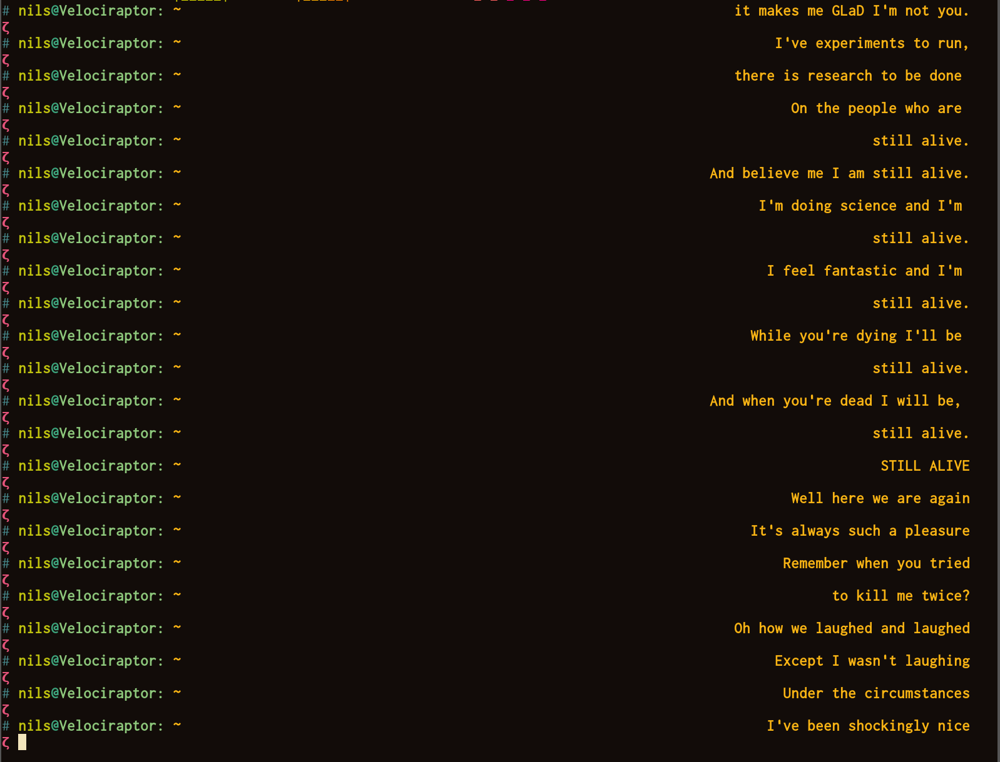

# Lyricer

This is a small and completely useless script that can show you lyrics of songs line-by-line. Executing lyricer.sh will display a line of some lyrics of a song. When executing lyricer again, it will display the next line of the song. This goes on until the song is finished - once finished, lyricer will cycle to the next song. Songs can be stored in the `songs` directory.

The songs are really just text files, so just put into them whatever you can imagine: Your grocery list, your familiy's brithdays or your favourite Navy Seal Copypasta!

Lyricer is kinda neat when you run it multiple times in quick succession, so that you can see the lyrics passing by. One neat application (which is actually what I wrote Lyricer for) is displaying song texts in the command prompt:

Setting your command prompt like that differs depending on your shell, but for zsh in combination with oh-my-zsh you can just edit `$ZSH/themes/$ZSH_THEME.zsh_theme` and adjust your prompt there.
